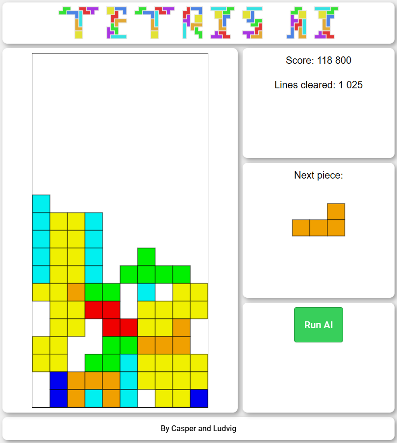

# TNM114 - Tetris AI

Project in course TNM11 - Articial Intelligence for Interactive Media at Linköping university HT2023.

An implementation of Tetris from scratch in JavaScript with a toggleable AI that places the pieces in optimal positions for longevity. The AI evaluates the current piece, by iterating all the possible positions and rotations to place it, together with the next piece (since it is known through the UI). After virtually placing the pieces in its memory, it evaluates the entire grid by the following attributes:

- Aggregated height (for all columns)
- Number of complete lines
- Number of holes in the grid
- Bumpiness (absolute difference in height between adjacent columns)

All these attributes are combined as a weighted sum, and the position with the highest value is selected.



## Folder structure

```
.
├───css             # Styling for the website
├───images          # Images for UI and tab icon
├───js              # JavaScript, main files
├───index.html      # HTML for the website
└───README.md
```

## Setup instructions

The tool requires a webserver to run. Setup is for live server in VSCode. Any other server method will work.

- Install [Live Server](https://marketplace.visualstudio.com/items?itemName=ritwickdey.LiveServer) extension in VSCode.
- Open the main folder in VSCode (Ctrl+Shift+E)
- Press the _Go Live_ text at the bottom menu bar
- The website should open automatically, otherwise it is usually hosted at [http://127.0.0.1:5501/](http://127.0.0.1:5501/)
